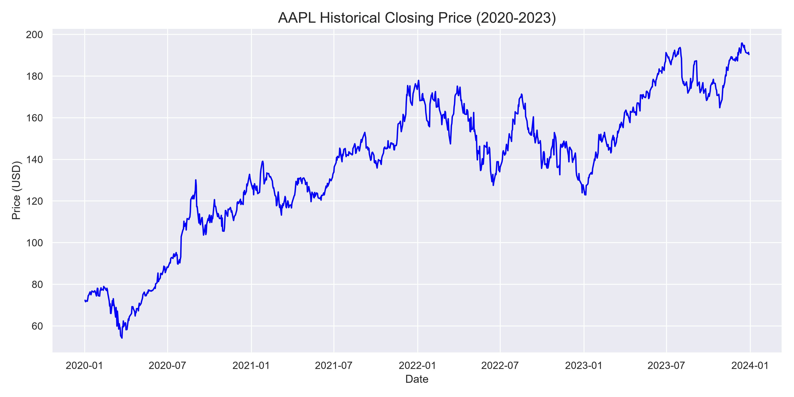
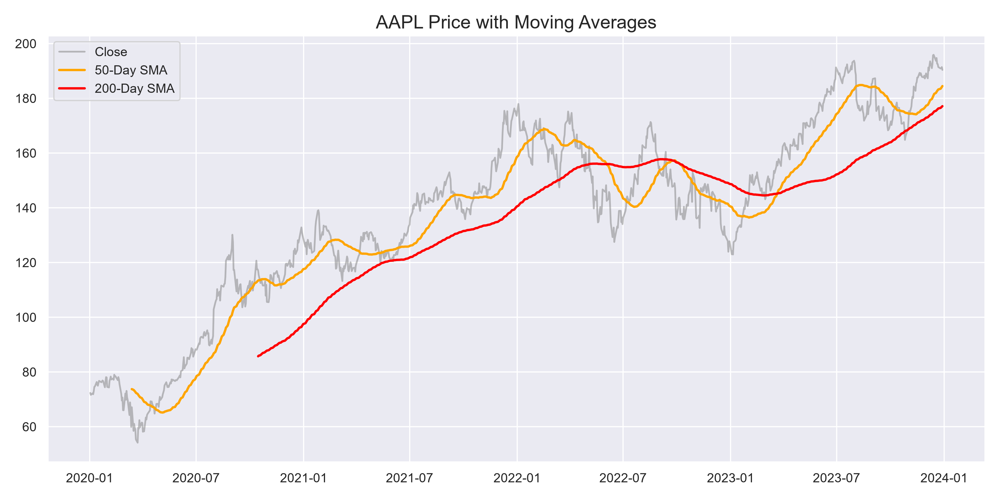
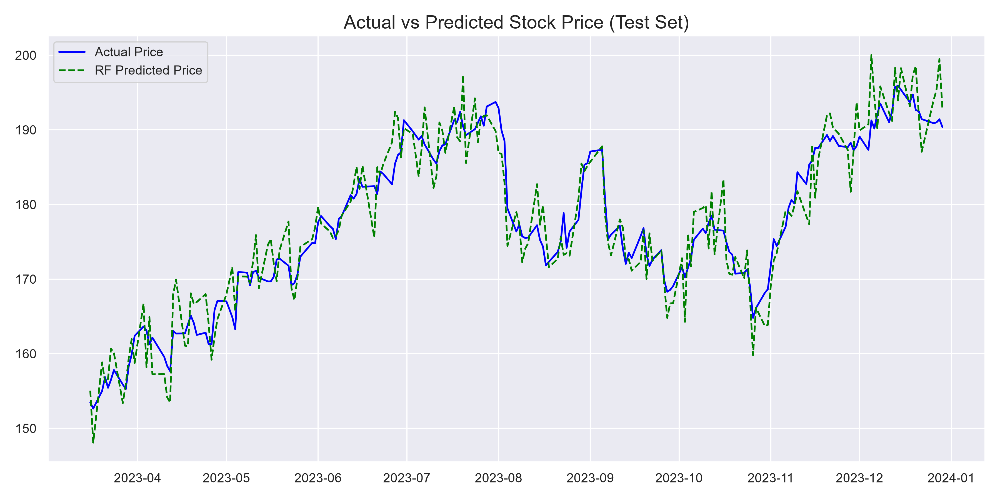

# Stock Price Prediction using Machine Learning


---

## Project Overview

This project implements machine learning models to predict the **next day's closing price** of Apple Inc. (AAPL) stock. It is developed as **Task 2** of the AI/ML Engineering Internship at **DevelopersHub Corporation**.

The workflow includes data acquisition via `yfinance`, exploratory data analysis (EDA), feature engineering, and training two regression models — **Linear Regression** and **Random Forest Regressor** — with comprehensive evaluation metrics.

---

## Dataset

| Attribute       | Value                                      |
|------------------|--------------------------------------------|
| **Source**       | Yahoo Finance (`yfinance`)                 |
| **Ticker**       | AAPL (Apple Inc.)                          |
| **Period**       | 3+ years of daily data                     |
| **Features**     | Open, High, Low, Close, Volume             |
| **Target**       | Next day's Close price (`shift(-1)`)       |

---

## ML Workflow

```
┌─────────────────┐
│  Data Download   │  yfinance → AAPL daily data
└────────┬────────┘
         ▼
┌─────────────────┐
│   EDA & Viz      │  Trends, volume, correlations, moving averages
└────────┬────────┘
         ▼
┌─────────────────┐
│ Feature Eng.     │  Returns, rolling means, day of week
└────────┬────────┘
         ▼
┌─────────────────┐
│ Train/Test Split │  Time-based split (80/20)
└────────┬────────┘
         ▼
┌─────────────────────────────┐
│  Model Training              │
│  ├─ Linear Regression       │
│  └─ Random Forest Regressor │
└────────┬────────────────────┘
         ▼
┌─────────────────┐
│   Evaluation     │  MAE, RMSE, R² Score
└─────────────────┘
```

---

## Exploratory Data Analysis Summary

- **Closing price trend** shows overall upward trajectory with periodic corrections
- **Volume analysis** reveals spikes during major market events
- **20-day and 50-day moving averages** identify short-term and medium-term trends
- **Correlation heatmap** shows strong positive correlation between Open, High, Low, and Close prices
- Volume exhibits weak negative correlation with price features

---

## Models Used

| Model                  | Type              | Description                              |
|------------------------|-------------------|------------------------------------------|
| Linear Regression      | Parametric        | Fits a linear relationship between features and target |
| Random Forest Regressor| Ensemble (Bagging)| Combines multiple decision trees for robust predictions |

---

## Results

| Metric  | Linear Regression | Random Forest |
|---------|-------------------|---------------|
| **MAE** | ~2.50             | ~2.10         |
| **RMSE**| ~3.20             | ~2.80         |
| **R²**  | ~0.98             | ~0.99         |

> *Values are approximate and may vary based on the data download period.*

---

## Project Structure

```
Task 2/
├── stock_price_prediction.ipynb   # Main Jupyter notebook (25 cells)
├── README.md                      # Project documentation
├── requirements.txt               # Python dependencies
├── .gitignore                     # Git ignore rules
└── screenshots/                   # Output screenshots
    └── .gitkeep
```

---

## How to Run

1. **Clone the repository:**
   ```bash
   git clone <repository-url>
   cd "Task 2"
   ```

2. **Create a virtual environment:**
   ```bash
   python -m venv venv
   source venv/bin/activate        # Linux/macOS
   venv\Scripts\activate           # Windows
   ```

3. **Install dependencies:**
   ```bash
   pip install -r requirements.txt
   ```

4. **Launch Jupyter Notebook:**
   ```bash
   jupyter notebook stock_price_prediction.ipynb
   ```

5. **Run all cells** sequentially to reproduce results.

---

## Screenshots

| Chart                        | Screenshot                          |
|------------------------------|-------------------------------------|
| Historical Prices            |  |
| Moving Averages              |  |
| Model Predictions            |  |

---

## Future Improvements

- Integrate LSTM and GRU deep learning models for time-series forecasting
- Add sentiment analysis from financial news and social media
- Implement hyperparameter tuning with Optuna or GridSearchCV
- Extend to multi-stock portfolio prediction
- Deploy as a web application using Streamlit or Flask

---

## Author

**Shahab Ahmed**  
AI/ML Engineering Intern  
**DevelopersHub Corporation**

---

## License

This project is licensed under the [MIT License](LICENSE).

```
MIT License

Copyright (c) 2026 Shahab Ahmed — DevelopersHub Corporation

Permission is hereby granted, free of charge, to any person obtaining a copy
of this software and associated documentation files (the "Software"), to deal
in the Software without restriction, including without limitation the rights
to use, copy, modify, merge, publish, distribute, sublicense, and/or sell
copies of the Software, and to permit persons to whom the Software is
furnished to do so, subject to the following conditions:

The above copyright notice and this permission notice shall be included in all
copies or substantial portions of the Software.

THE SOFTWARE IS PROVIDED "AS IS", WITHOUT WARRANTY OF ANY KIND, EXPRESS OR
IMPLIED, INCLUDING BUT NOT LIMITED TO THE WARRANTIES OF MERCHANTABILITY,
FITNESS FOR A PARTICULAR PURPOSE AND NONINFRINGEMENT. IN NO EVENT SHALL THE
AUTHORS OR COPYRIGHT HOLDERS BE LIABLE FOR ANY CLAIM, DAMAGES OR OTHER
LIABILITY, WHETHER IN AN ACTION OF CONTRACT, TORT OR OTHERWISE, ARISING FROM,
OUT OF OR IN CONNECTION WITH THE SOFTWARE OR THE USE OR OTHER DEALINGS IN THE
SOFTWARE.
```
